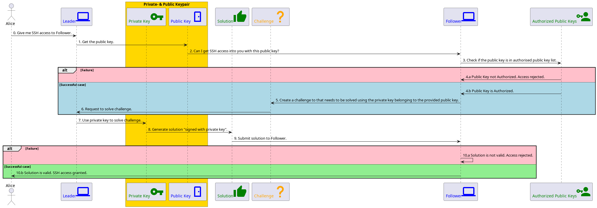

# Sets up tor over SSH

Ensures you can access your computer from anywhere in the world with a single
command. To show how this code, and ssh access in general, works, the
following schematic is included for:

\**Initial Setup* (what this module does):


The relevant part is step `c. d.` because you can copy the public key into the
in different ways using this repository:

- Manually, just type it in with `--leader-public-key somelongkeywithalotofdigits`
  when you run this on the `Follower`.

- Manually, if you have physical access, you can copy the public key using a
  USB stick and give the path to that file with
  `--leader-public-key-path /your/drive/public.key` when you run this on
  the `Follower`.

- Automatically, if you already have SSH access set up to the follower, e.g.
  over wifi or lan, type:

  ```sh
  --ssh-follower-username the_ubuntu_username_of_your_follower
  --ssh-follower-address the_ip_address_of_your_follower
  ```

- Automatically, if you want this repo to try and set up local SSH access
  into the follower, type:

  ```sh
  --ssh-follower-username the_ubuntu_username_of_your_follower
  --ssh-follower-address the_ip_address_of_your_follower
  ```

## FAQ

You may wonder why would you want to setup SSH access when you already have
local SSH access?

- Maybe you travel with your `Follower`, and would simply always like to
  have `SSH` access without hassle, e.g. from phone into your laptop, or the
  other way round.
- You may not feel the need to pay for NGROK.
- You may not feel the need to buy/register a domain name.
- Your house/apartment/flat/planet/internet location/island may pile all your
  devices onto a single public IP without providing you port-forwarding options.
- Your house/apartment/flat/planet/internet location/island may not allow
  picking your own public static ~~void~~ IP address, meaning you cannot
  consistently SSH access into your `Follower` device.
- Your `Follower` device might change IP-addresses when it resets.

**Usage**

It is a rough approximation of what happens behind the screens when you type:

```sh
ssh <your username>@<some ip address>
```

## CLI Usage

Since you SSH from one computer (client) into another (server):

**client** - The pc that you use to control the server.
**server** - The pc that you access and control.

You run this utility on both machines to set them up. First ensure the server
is up and running on tor, with an onion domain.

```sh
src/main.sh --server
```

That spits out the onion domain like:

```txt
You can ssh into this server with command:
torsocks ssh ubuntu_username_on_your_server@somelongoniondomainabcdefghikjlmnop.onion
```

Then copy that onion domain to your client machine/pc, and run:

```sh
src/main.sh --client --onion somelongoniondomainabcdefghikjlmnop.onion
```

## Install this bash dependency in other repo

- In your other repo, include a file named: `.gitmodules` that includes:

```sh
[submodule "dependencies/bash-ssh-over-tor"]
 path = dependencies/bash-ssh-over-tor
 url = https://github.com/hiveminds/bash-ssh-over-tor
```

- Create a file named `install_dependencies.sh` with content:

```sh
# Remove the submodules if they were still in the repo.
git rm --cached dependencies/bash-ssh-over-tor

# Remove and re-create the submodule directory.
rm -r dependencies/bash-ssh-over-tor
mkdir -p dependencies/bash-ssh-over-tor

# (Re) add the BATS submodules to this repository.
git submodule add --force https://github.com/hiveminds/bash-ssh-over-tor dependencies/bash-ssh-over-tor
```

- Install the submodule with:

```sh
chmod +x install-dependencies.sh
./install-dependencies.sh
```

## Call this bash dependency from other repo

After including this dependency you can use the functions in this module like:

```sh
#!/bin/bash

# Source the file containing the functions
source "$(dirname "${BASH_SOURCE[0]}")/src/main.sh"

# Naming conventions:
# server - The pc that you access and control.
# client - The pc that you use to control the server.

# Configure tor and ssh such that allows ssh access over tor.
configure_ssh_over_tor_at_boot
```

The `0` and `1` after the package name indicate whether it will update the
package manager afterwards (`0` = no update, `1` = package manager update after
installation/removal)

## Testing

Put your unit test files (with extension .bats) in folder: `/test/`

### Prerequisites

(Re)-install the required submodules with:

```sh
chmod +x install-dependencies.sh
./install-dependencies.sh
```

Install:

```sh
sudo gem install bats
sudo apt install bats -y
sudo gem install bashcov
sudo apt install shfmt -y
pre-commit install
pre-commit autoupdate
```

### Pre-commit

Run pre-commit with:

```sh
pre-commit run --all
```

### Tests

Run the tests with:

```sh
bats test
```

If you want to run particular tests, you could use the `test.sh` file:

```sh
chmod +x test.sh
./test.sh
```

### Code coverage

```sh
bashcov bats test
```

## How to help

- Include bash code coverage in GitLab CI.
- Add [additional](https://pre-commit.com/hooks.html) (relevant) pre-commit hooks.
- Develop Bash documentation checks
  [here](https://github.com/TruCol/checkstyle-for-bash), and add them to this
  pre-commit.
