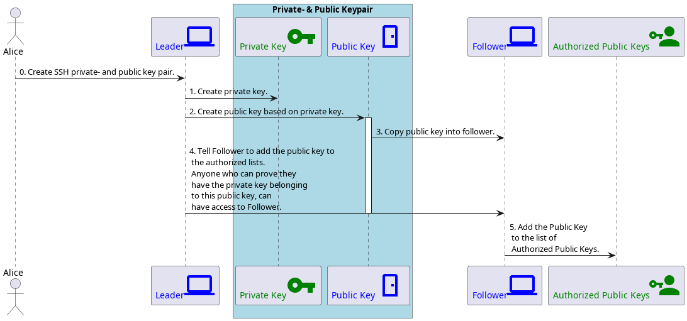

# SSH Explanation

This document gives a basic understanding on how SSH works, and then zooms in
the 1 step of the SSH process that is relevant to this repository; *copying
the public key into the follower device*. Below are some frequently asked questions.

## Initial Setup (what this repository does for you)



The relevant part is step `3.` because you can copy the public key into the
in different ways using this repository:

- Manually, just type it in with `--leader-public-key somelongkeywithalotofdigits`
  when you run this on the `Follower`.

- Manually, if you have physical access, you can copy the public key using a
  USB stick and give the path to that file with
  `--leader-public-key-path /your/drive/public.key` when you run this on
  the `Follower`.

- Automatically, if you already have SSH access set up to the follower, e.g.
  over wifi or lan, type:

  ```sh
  --ssh-follower-username the_ubuntu_username_of_your_follower
  --ssh-follower-address the_ip_address_of_your_follower
  ```

- Automatically, if you want this repo to try and set up local SSH access
  into the follower, type:

  ```sh
  --ssh-follower-username the_ubuntu_username_of_your_follower
  --ssh-follower-address the_ip_address_of_your_follower
  ```

## Usage

For completeness here is a diagram on what happens when you do `ssh name@ip_address`:


## FAQ

You may wonder why would you want to setup SSH access when you already have
local SSH access?

- Mainly because it is the easiest self-hosted SSH setup that works anywhere
  (with Tor access) on Earth, with the tor network as sole dependency.
- Maybe you travel with your `Follower` (or `Leader`, or both), and would
  simply always like to have `SSH` access without hassle, e.g. from phone into
  your laptop, or the other way round.
- You may not feel the need to pay for NGROK.
- You may not feel the need to buy/register a domain name.
- You may not feel the need to host/setup a DNS for your domain name.
- Your house/apartment/flat/planet/internet location/island may pile all your
  devices onto a single public IP without providing you port-forwarding options.
- Your house/apartment/flat/planet/internet location/island may not allow
  picking your own public static ~~void~~ IP address, meaning you cannot
  consistently SSH access into your `Follower` device.
- Your `Follower` device might change IP-addresses when it resets.
